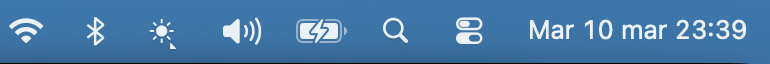
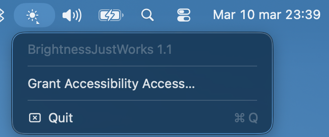
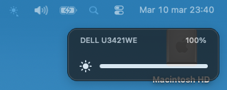
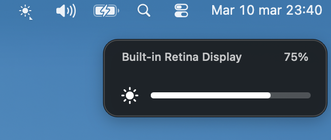

# BrightnessJustWorks

A macOS menu bar utility that routes the physical brightness keys (F1/F2) to whichever display your mouse cursor is currently on — built-in panel or external monitor.

## Download

**[Download the latest release](https://github.com/davic80/BrightnessJustWorks/releases/latest)**

Two options are available on every release:
- `BrightnessJustWorks-vX.Y.Z.pkg` — installer (recommended)
- `BrightnessJustWorks-vX.Y.Z.zip` — manual drag-and-drop

## Screenshots

### Menu bar icon


### Menu


### Brightness overlay — external display


### Brightness overlay — built-in display


## The problem

macOS hardwires the brightness keys to the built-in display. If your cursor is on an external monitor, pressing F1/F2 does nothing useful. BrightnessJustWorks intercepts those keys and sends the adjustment to the right screen automatically.

## Features

- Intercepts the system brightness keys system-wide via a `CGEventTap` (Accessibility API)
- Routes brightness up/down to the display under the mouse cursor
- Controls the **built-in display** via `DisplayServices` (smooth, native)
- Controls **external monitors** via DDC/CI over Thunderbolt/USB-C using `IOAVService` (Apple Silicon)
- Shows a native brightness OSD overlay — display name, brightness percentage, sun icon and smooth pill progress bar — in the top-right corner of the active display, just below the menu bar
- Menu bar only — no Dock icon, no windows
- Step size: ±6.25% (1/16 steps) for internal; ±6 on 0–100 DDC scale for external

## Requirements

- Apple Silicon Mac (M series: M1 and later)
- macOS 12 Monterey or later
- Accessibility permission (prompted on first launch)
- Xcode 14 or later (to build from source only)

## Install

### Using the installer (recommended)

1. Download `BrightnessJustWorks-vX.Y.Z.pkg` from the [latest release](https://github.com/davic80/BrightnessJustWorks/releases/latest).
2. Double-click the `.pkg` file and follow the installer steps.
3. The app is placed in `/Applications` and launched automatically.
4. Grant **Accessibility** access when prompted (see [First launch](#first-launch)).

### Manual install (zip)

1. Download `BrightnessJustWorks-vX.Y.Z.zip`, unzip it.
2. Move `BrightnessJustWorks.app` to `/Applications/`.
3. Follow the [First launch](#first-launch) instructions below.

## First launch

### 1. Allow the app to open

Because BrightnessJustWorks is not signed with an Apple Developer ID, macOS will block it the first time with:

> *"BrightnessJustWorks cannot be opened because it is from an unidentified developer."*

To open it anyway:

1. In Finder, **right-click** (or Control-click) `BrightnessJustWorks.app`
2. Choose **Open** from the context menu
3. Click **Open** in the dialog that appears

> The `.pkg` installer removes the quarantine attribute automatically — you only need this step for the manual zip install.

### 2. Grant Accessibility access

On first launch a system prompt will ask for Accessibility access. This is required because the app uses a **`CGEventTap`** — a macOS API that intercepts global keyboard events before the system handles them — to capture F1/F2 at the hardware level and route them to the correct display. Without this permission the keys cannot be intercepted.

Grant it in:

**System Settings → Privacy & Security → Accessibility → BrightnessJustWorks → toggle on**

The app will start working immediately after permission is granted — no restart needed.

## Uninstall

Click the menu bar icon and choose **Uninstall…**

This will:
- Ask for confirmation
- Revoke the Accessibility permission (`tccutil reset`)
- Remove `/Applications/BrightnessJustWorks.app`
- Quit the app

## Building from source

```bash
git clone https://github.com/davic80/BrightnessJustWorks.git
cd BrightnessJustWorks

/Applications/Xcode.app/Contents/Developer/usr/bin/xcodebuild \
  -project BrightCursor.xcodeproj \
  -scheme BrightnessJustWorks \
  -configuration Release \
  SYMROOT=/tmp/BJWBuild
```

The built app is at `/tmp/BJWBuild/Release/BrightnessJustWorks.app`. Copy it to `/Applications/`:

```bash
cp -R /tmp/BJWBuild/Release/BrightnessJustWorks.app /Applications/
open /Applications/BrightnessJustWorks.app
```

To build the installer pkg locally:

```bash
bash installer/build_pkg.sh /tmp/BJWBuild/Release v1.2.0
# produces: /tmp/BJWBuild/Release/BrightnessJustWorks-v1.2.0.pkg
```

## How it works

| Component | What it does |
|---|---|
| `BrightnessKeyInterceptor` | Installs a `CGEventTap` to intercept `NX_KEYTYPE_BRIGHTNESS_UP/DOWN` before the system handles them |
| `DisplayRouter` | Finds the `CGDirectDisplayID` of the screen the mouse cursor is on |
| `InternalBrightnessController` | Calls `DisplayServicesSetBrightness()` for the built-in Retina panel |
| `ExternalBrightnessController` | Sends DDC VCP code `0x10` (brightness) via `IOAVServiceWriteI2C()` |
| `BrightnessOverlay` | Shows a native `NSPanel` OSD in the top-right corner of the active display — display name and brightness percentage text row, dark rounded pill, SF Symbol sun icon, smooth CAAnimation pill progress bar, auto-dismiss with fade |

## Why not on the Mac App Store

BrightnessJustWorks relies on private Apple APIs (`IOAVService`, `DisplayServices`) and requires a global `CGEventTap` via the Accessibility API — neither of which is permitted in the App Store sandbox. It is distributed directly, similar to other display utilities like [MonitorControl](https://github.com/MonitorControl/MonitorControl).

## License

MIT — see [LICENSE](LICENSE).
